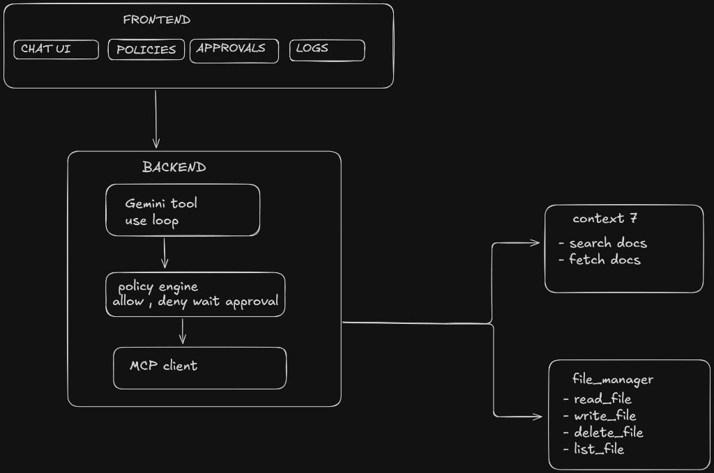
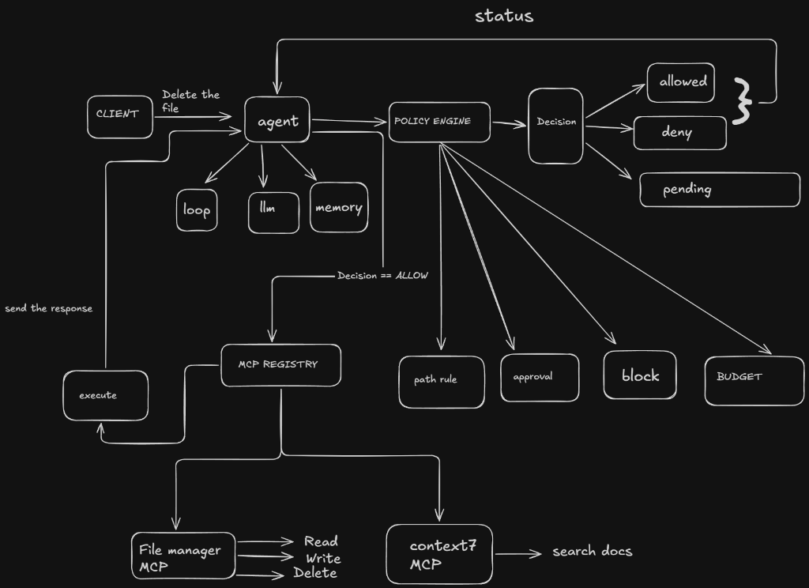

# Gatekeeper

Gatekeeper is a safety layer for LLM agents. When an agent decides to call a tool (like reading, writing, or deleting a file), Gatekeeper intercepts that call and checks it against active policy rules—such as directory sandboxing, token budgets, and human-in-the-loop approvals—before letting it execute.

The repository is structured as a monorepo containing a Next.js frontend, an Express API backend (which manages the LLM agent and policy engine), and a custom Model Context Protocol (MCP) server for file system operations.

## DEMO
[](https://youtu.be/wyeKKbvEvQM)

---

## Architecture Overview

Here is how the frontend, backend, and MCP servers communicate:



1. **Frontend ([apps/web](file:///home/yb175/projects/gate-keeper/apps/web))**: A Next.js dashboard providing a chat interface, policy management panel, approval queue, and audit logs.
2. **Backend ([apps/api](file:///home/yb175/projects/gate-keeper/apps/api))**: An Express server running the LLM agent loop (supporting Gemini 2.5 Flash and Grok), the policy engine, and the MCP client.
3. **MCP Servers**: Subprocesses spawned by the backend over Stdio. This includes a custom [file-manager-mcp](file:///home/yb175/projects/gate-keeper/apps/file-manager-mcp) for safe file operations, and external servers like `@upstash/context7-mcp` (for fetching documentation) and `@modelcontextprotocol/server-puppeteer` (for web browsing).

---

## Core Execution Flow

The system runs on an interception and evaluation loop. Here is the actual flow:



Below is the step-by-step block diagram of the workflow:

```
                  ┌──────────────────────────────────────────────┐
                  │                 USER / CLIENT                │
                  └──────────────┬────────────────────────▲──────┘
                                 │                        │
                   (User Prompt) │                        │ (Response)
                                 ▼                        │
                  ┌───────────────────────────────────────┴──────┐
                  │                  LLM AGENT                   │ ◄───────────────────────────┐
                  │           (Gemini / Grok Loop)               │                             │
                  └──────────────┬───────────────────────────────┘                             │
                                 │                                                             │
                  (Generates Tool│ Call: e.g. "deleteFile")                                    │
                                 ▼                                                             │
                  ┌──────────────────────────────────────────────┐                             │
                  │                POLICY ENGINE                 │                             │
                  │   Evaluates:                                 │                             │
                  │   - Block Check (block.ts)                   │                             │
                  │   - Sandbox Path Check (pathRule.ts)         │                             │
                  │   - Token Budget Check (budget.ts)           │                             │
                  │   - Manual Approval Check (approval.ts)      │                             │
                  └──────────────┬───────────────────────────────┘                             │
                                 │                                                             │
                                 ▼                                                             │
                   [ Evaluates Decision Outcome ]                                              │
                    /            │            \                                                │
                   /             │             \                                               │
           (ALLOW)               │ (DENY)       \ (PENDING)                                    │
           /                     │               \                                             │
          ▼                      ▼                ▼                                            │
  ┌───────────────┐      ┌───────────────┐   ┌────────────────────────┐                        │
  │ MCP Registry  │      │ Write Audit   │   │ Create DB Approval     │                        │
  │ & Exec Client │      │ Log to DB     │   └───────────┬────────────┘                        │
  └───────┬───────┘      └───────┬───────┘               │                                     │
          │                      │                       ▼                                     │
          ▼                      ▼               ┌────────────────────────┐                    │
  ┌───────────────┐      ┌───────────────┐       │ Show in Admin Panel    │                    │
  │ Execute Tool  │      │ Return Error  │       │ (Awaiting User Action) │                    │
  │ on MCP Server │      │ to LLM Agent  ├──────►└───────────┬────────────┘                    │
  └───────┬───────┘      └───────┬───────┘                   │                                 │
          │                      │                           │                                 │
          ▼                      │                           ▼                                 │
  ┌───────────────┐              │                  [ User Decides ]                           │
  │ Return Output │              │                   /            \                            │
  │ to LLM Agent  ├──────────────┘                  /              \                           │
  └───────────────┘                          (Approve)             (Reject)                    │
                                               /                      \                        │
                                              ▼                        ▼                       │
                                      ┌───────────────┐        ┌───────────────┐               │
                                      │ Update status │        │ Update status │               │
                                      │ to APPROVED   │        │ to REJECTED   │               │
                                      └───────┬───────┘        └───────┬───────┘               │
                                              │                        │                       │
                                              ▼                        ▼                       │
                                      ┌───────────────┐        ┌───────────────┐               │
                                      │ Resume Agent  │        │ Resume Agent  │               │
                                      │ Loop with     │        │ Loop and      │               │
                                      │ Tool Allowed  │        │ Deny Tool     │               │
                                      └───────┬───────┘        └───────┬───────┘               │
                                              │                        │                       │
                                              └────────────────────────┴───────────────────────┘
```

### Decision States

- **`ALLOW`**: The tool runs immediately. The MCP client performs the operation and returns the outcome to the LLM agent.
- **`DENY`**: The tool is blocked. A denial log is written to the database, and the error is returned to the agent.
- **`PENDING`**: Execution is suspended. The engine writes an approval record to the SQLite database and pauses the loop. Once a user clicks **Approve** or **Reject** in the frontend UI, the backend resumes the loop to process the tool call.

## Monorepo Codebase Breakdown

- **[apps/api](file:///home/yb175/projects/gate-keeper/apps/api)**:
  - [src/index.ts](file:///home/yb175/projects/gate-keeper/apps/api/src/index.ts) - The Express app entry point.
  - [src/agent/loop.ts](file:///home/yb175/projects/gate-keeper/apps/api/src/agent/loop.ts) - The execution loop managing LLM calls, step generation, and policy enforcement.
  - [src/policy/decision.ts](file:///home/yb175/projects/gate-keeper/apps/api/src/policy/decision.ts) - Orchestrates the database check, logging, and state management for approvals.
  - [src/policy/engine.ts](file:///home/yb175/projects/gate-keeper/apps/api/src/policy/engine.ts) - Runs the pipeline of rule checks (Block -> Path Sandbox -> Budget -> Approval).
  - [mcp/bootstrap.ts](file:///home/yb175/projects/gate-keeper/apps/api/mcp/bootstrap.ts) - Spawns and manages standard input/output connections to MCP servers.
- **[apps/web](file:///home/yb175/projects/gate-keeper/apps/web)**:
  - [app/chat/page.tsx](file:///home/yb175/projects/gate-keeper/apps/web/app/chat/page.tsx) - Next.js chat interface to talk with the agent.
  - [app/approvals/page.tsx](file:///home/yb175/projects/gate-keeper/apps/web/app/approvals/page.tsx) - Interactive queue to approve or reject pending tool calls.
  - [app/policies/page.tsx](file:///home/yb175/projects/gate-keeper/apps/web/app/policies/page.tsx) - Form to configure path rules, block lists, and approvals for each tool.
- **[apps/file-manager-mcp](file:///home/yb175/projects/gate-keeper/apps/file-manager-mcp)**:
  - [src/tools/](file:///home/yb175/projects/gate-keeper/apps/file-manager-mcp/src/tools) - The safe filesystem tools: `deleteFile`, `listFiles`, `moveFile`, `readFile`, and `writeFile`.
- **[packages/db](file:///home/yb175/projects/gate-keeper/packages/db)**:
  - [prisma/schema.prisma](file:///home/yb175/projects/gate-keeper/packages/db/prisma/schema.prisma) - Prisma schema using SQLite. Stores audit logs, policies, pending approvals, and token budget conversation sessions.

---

## How to Start the Project

Follow these steps to set up and run the application locally.

### 1. Install Dependencies

Ensure you have Node.js (>= 18) installed, then run the following in the project root:

```bash
npm install
```

### 2. Configure Environment Variables

Copy the sample environment file and fill in your keys:

```bash
cp .env.sample .env
```

Open [.env](file:///home/yb175/projects/gate-keeper/.env) and populate the following keys:

- `GEMINI_API_KEY`: API key for Gemini 2.5 Flash.
- `GROK_API_KEY`: Fallback xAI Grok API key.
- `CONTEXT7_API_KEY`: (Optional) Upstash context7 API key for documentation querying.
- Or set `MOCK_LLM=true` to test the agent loop offline with mock responses.

### 3. Initialize the SQLite Database

Run Prisma migrations to set up the database tables:

```bash
npm run db:generate -w @repo/db
npm run db:push -w @repo/db
```

> [!NOTE]
> **Why SQLite?**
> SQLite is intentionally chosen for this proof-of-concept to keep local setup, testing, and portability simple with zero configuration. For a production deployment with high concurrency, PostgreSQL is recommended and can be easily swapped in via Prisma.

### 4. Run the Dev Servers

Start the frontend, backend, and build watcher concurrently:

```bash
npm run dev
```

Once started, you can access the application at:

- **Frontend**: [http://localhost:3000](http://localhost:3000)
- **Backend API**: [http://localhost:3001](http://localhost:3001)

### 5. Running Tests

You can run vitest suites to verify all rules and server communication:

```bash
# Run backend API tests
npm run test -w api

# Run file-manager tests
npm run test -w file-manager-mcp
```
