# Database Package (`@repo/db`)

This package manages the database access, schemas, migrations, and Prisma Client generation for the **Gatekeeper** system.

It uses **Prisma ORM** with a **SQLite** database to store policy definitions, log tool executions, manage manual approvals, and track conversation budgets.

---

## Schema Architecture Overview

The database contains four core tables designed to support policy enforcement, logging, human-in-the-loop approvals, and budget limits. They are independent tables structured to support high-throughput lookups and auditability.

```mermaid
erDiagram
    Log {
        String id PK "UUID"
        String tool_name "Name of the invoked tool"
        Decision decision "Enforced decision (ALLOW | DENY | PENDING | FAILED)"
        String reason "Nullable reason for decision"
        DateTime createdAt "Timestamp of the execution"
    }

    Approval {
        String id PK "UUID"
        String tool_name "Name of the tool awaiting approval"
        Json arguments "JSON arguments passed to the tool"
        ApprovalStatus status "Approval state (PENDING | APPROVED | REJECTED)"
        DateTime createdAt "Timestamp of creation"
        DateTime updatedAt "Timestamp of last update"
    }

    Policy {
        String id PK "UUID"
        String tool_name UK "Unique tool identifier"
        PolicyAction action "Policy decision (ALLOW | APPROVAL | DENY)"
        String sandbox_path "Nullable restricted access path"
        DateTime createdAt "Timestamp of creation"
        DateTime updatedAt "Timestamp of last update"
    }

    Conversation {
        String id PK "UUID"
        Int tokens_used "Total tokens used in conversation"
        Int budget_limit "Upper limit for tokens"
        DateTime createdAt "Timestamp of creation"
    }
```



---

## Detailed Model Definitions

### 1. `Policy`

Defines the governing rule for a specific Model Context Protocol (MCP) tool. The policy engine queries this table during tool invocation to determine whether to execute, block, or request human approval.

| Field          | Type           | Attributes                | Description                                                          |
| :------------- | :------------- | :------------------------ | :------------------------------------------------------------------- |
| `id`           | `String`       | `@id`, `@default(uuid())` | Primary key (UUID).                                                  |
| `tool_name`    | `String`       | `@unique`                 | The target tool name (e.g., `file-manager-mcp/write_file`).          |
| `action`       | `PolicyAction` | Enforced Enum             | The policy action applied when this tool is requested.               |
| `sandbox_path` | `String?`      | Optional                  | Directory path constraint if the tool requires filesystem isolation. |
| `createdAt`    | `DateTime`     | `@default(now())`         | Creation timestamp.                                                  |
| `updatedAt`    | `DateTime`     | `@updatedAt`              | Auto-updated modification timestamp.                                 |

#### Associated Enum: `PolicyAction`

Controls execution behavior:

- `ALLOW`: Execute the tool immediately without manual user intervention.
- `APPROVAL`: Suspend execution and queue a human-in-the-loop approval request.
- `DENY`: Block tool execution outright.

---

### 2. `Approval`

Manages the state of asynchronous human-in-the-loop confirmation requests for tools configured with the `APPROVAL` action.

| Field       | Type             | Attributes                | Description                                           |
| :---------- | :--------------- | :------------------------ | :---------------------------------------------------- |
| `id`        | `String`         | `@id`, `@default(uuid())` | Primary key (UUID).                                   |
| `tool_name` | `String`         | -                         | The name of the tool requesting approval.             |
| `arguments` | `Json`           | -                         | The structured parameters / inputs sent by the model. |
| `status`    | `ApprovalStatus` | Enforced Enum             | The current resolution state of the request.          |
| `createdAt` | `DateTime`       | `@default(now())`         | Creation timestamp.                                   |
| `updatedAt` | `DateTime`       | `@updatedAt`              | Resolution/modification timestamp.                    |

#### Associated Enum: `ApprovalStatus`

- `PENDING`: Waiting for user response (Accept / Deny).
- `APPROVED`: Confirmed by user; tool will proceed to run.
- `REJECTED`: Denied by user; execution aborted.

---

### 3. `Log`

Acts as an audit trail, keeping records of every decision made by the policy engine and execution outcomes.

| Field       | Type       | Attributes                | Description                                                      |
| :---------- | :--------- | :------------------------ | :--------------------------------------------------------------- |
| `id`        | `String`   | `@id`, `@default(uuid())` | Primary key (UUID).                                              |
| `tool_name` | `String`   | -                         | Name of the tool evaluated/executed.                             |
| `decision`  | `Decision` | Enforced Enum             | The result of the policy engine evaluation.                      |
| `reason`    | `String?`  | Optional                  | Contextual details (e.g., reason for denial, validation errors). |
| `createdAt` | `DateTime` | `@default(now())`         | Execution timestamp.                                             |

#### Associated Enum: `Decision`

- `ALLOW`: Tool was allowed and executed.
- `DENY`: Tool execution was blocked.
- `PENDING`: Tool execution is paused, waiting for user approval.
- `FAILED`: Execution failed due to a system error or timeout.

---

### 4. `Conversation`

Tracks API usage tokens and enforces token budgets to prevent runaway loops or excessive resource spend.

| Field          | Type       | Attributes                | Description                                              |
| :------------- | :--------- | :------------------------ | :------------------------------------------------------- |
| `id`           | `String`   | `@id`, `@default(uuid())` | Primary key (UUID/Custom conversation identifier).       |
| `tokens_used`  | `Int`      | `@default(0)`             | Running counter of tokens consumed by the session.       |
| `budget_limit` | `Int`      | -                         | Upper limit of allowed token spend for the conversation. |
| `createdAt`    | `DateTime` | `@default(now())`         | Session creation timestamp.                              |

---

## Database Configuration

The database configuration is managed inside [schema.prisma](file:///home/yb175/projects/gate-keeper/packages/db/prisma/schema.prisma):

- **Provider**: SQLite (`sqlite`)
- **Connection URL**: `file:./dev.db` (local development SQLite file inside the `prisma` directory)

---

## Common Workflows & Commands

To manage and inspect the database, run the following commands from the project root or the package folder:

### 1. Build and Generate Client

Generate the type-safe Prisma Client package:

```sh
npm run build --filter=@repo/db
```

_Or directly within `/packages/db`:_

```sh
npx prisma generate
```

### 2. Run Database Migrations

Apply any schema changes to the local SQLite database:

```sh
npx prisma migrate dev --name <migration_name>
```

### 3. Database Inspection (Prisma Studio)

Open a visual database explorer locally:

```sh
npx prisma studio
```
